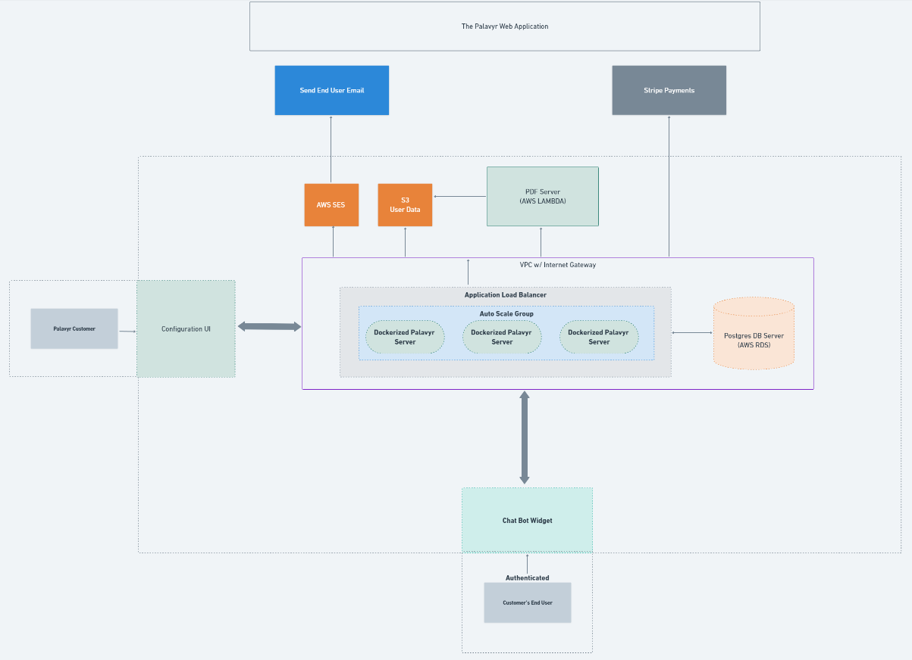

# Palavyr

## Overview

Palavyr is a web app that allows users to configure a chat bot. Currently, the main feature that sets this chat bot designer apart is the pricing strategy feature. This allows users to integrate questions into their chatbot that are then used to determine a fee estimate, which is then emailed to them via PDF. To create these PDFs, the PalavyrPDFServer is used. That server takes html strings created by Palavyr, and saves them to an S3 location. These are then retrieved by Palavyr and emailed on behalf of Palavyr Customers.

The target market for Palavyr is Law firms. Firms tend to have enquiries that are compatible with the Palavyr strategy / feature set, and I have already seen some firms implementing custom chat bots that perform this function.

Palavyr allows any law firm to integrate such a chat bot, without having to pay engineers thousands of dollars to create it.

## Project organization

Palavyr includes 2 subprojects:

1. server
1. ui

The Palavyr Server is an asp.net core 3.1 server that handles the heavy lifting. It is a private, stateless REST api that is used by both the Palavyr website (chat bot designer) as well as the Chat Bot Widget. Since it is stateless, it can be deployed in clusters, AWS Lambda, as well as separately to support both the website and the widget.

The Palavyr ui consists of the Chat bot designer Website and the Chat Bot widget. These are merged into the same project (under /ui) and have their own respective webpack configurations for dev and prod.

## Application architecture

The architecture of Palavyr is as follows:

## Production setup

The chat bot designer website is a react app served as a static website from an S3 bucket. This sits behind an AWS Cloudfront dist which provides SSL certificates. DNS is provided via Route53.

The Chatbot is also a react app served from an S3 bucket.

Postgress is the current database engine.

Ideally, the Palavyr server and PDF Server will be served via AWS Lambda (to reduce operating costs) until customers are onboarded and we can transition to EC2 instances behind a load balancer (which are a little bit faster).

## TODO

   -  We should use something like localstack in dev. (It spins up aws services locally in a dev environment) Doing so gets us around having to use aws during development.
   -  Extract the duplicated code in the chat bot desiger and replace it with the newly integrated widget code base. A nuanced refactor job.
   -  Get someone to sponsor the project or pay for the product. That would be cool. No pressure though. At the very least this is a really fun project to work on for funzies.

# Setup Guide

Follow this guide to get set up with development.

1. Download and install postgres 14

    https://www.postgresql.org/download/windows/

2. Use the download to create a postgres server - use default settings

3. Clone PalavyrPdfServer:

    `git clone git@github.com:Palavyr/PalavyrPdfServer.git`

4. Build and Start the pdf server by using

   `npm start` (to use serverless offline) OR `npm run start-ui` (to use a webpack build and dev server).

5. Clone Palavyr:

    `git clone git@github.com:Palavyr/Palavyr.git`

6. Step in to Palavyr/server/utilities and run

        `./SetDevelopmentalSecrets.ps1`

7. Start the DB migrator

    `dotnet run --project Palavyr.Data.Migrator`

8.  Build the server (in an IDE or using `dotnet build`)

9.  Run the server (via IDE or using `dotnet run --project Palavyr.API`)

10. Step into Palavyr/ui and build and run both the widget and the website using `npm start`, and in a separate window using `npm run start-widget`

11. Navigate to `localhost:8080` and create an account to begin developing

Thanks for your interest in contributing!

